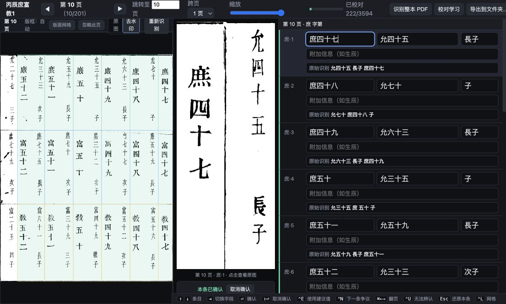
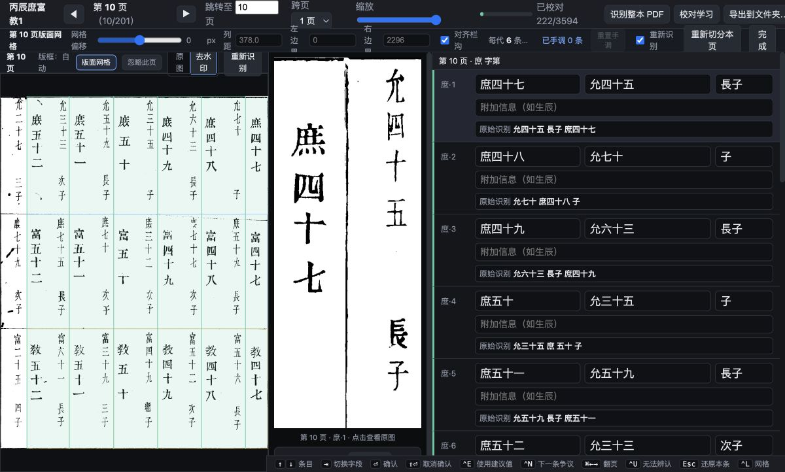
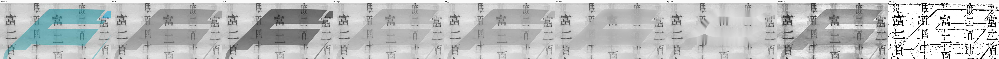

# Foresight OCR

Foresight OCR is a provenance-first pipeline for transcribing scanned Chinese
genealogy records (族譜 / 宗譜) into reviewable text and structured family data.
It is built for vertical Traditional Chinese, repeated genealogy layouts,
damaged pages, library watermarks, and records that continue across physical
page boundaries.

The project keeps image extraction, normalization, layout analysis, OCR, human
correction, validation, and genealogy reconstruction separate. Every result can
be traced back to the source pixels that produced it.

> **Project status:** research preview (`0.1.0`). The pipeline and review app
> are exercised against a real 201-page genealogy volume, but new document
> families still require an explicit profile and a checked layout template.

## What it looks like

### Review workspace



The page image, selected provenance crop, and structured transcription stay in
view together. Confirmed human readings are visibly distinguished from the raw
OCR candidate retained below each record.

### Layout editor



The same workspace exposes document geometry when needed: reviewers can adjust
grid offset, column pitch, page bounds, and gutter alignment before re-cutting a
page. Re-segmentation preserves stable region identity and existing human work.

### Image restoration benchmark



The restoration benchmark keeps competing image variants side by side. A
clean-looking page is not automatically a better OCR input: removing a cyan
stamp can also erase black ink underneath it, so model accuracy decides which
variant is useful.

## Capabilities

- Preserves embedded source rasters and records checksums before processing.
- Detects page frames, corrects scan displacement and perspective, and maps
  normalized coordinates back to original pixels.
- Learns repeated generation bands and vertical entry columns from the corpus,
  with editable YAML profiles and templates for document-specific structure.
- Benchmarks isolated OCR backends and image variants without overwriting raw
  model output.
- Parses printed generation IDs, father references, birth order, names, and
  optional free-form biographical text without modernizing the source.
- Uses consecutive IDs and reconstructed father links as structural checks that
  direct human attention to likely OCR or segmentation failures.
- Provides a local Chinese-language review workspace with multi-page context,
  re-cutting, re-OCR, page exclusion, correction history, progress, and export.
- Exports reviewed transcription data, a generation-ordered people table, and
  GEDCOM while keeping machine output separate from human corrections.

## Pipeline

```text
PDF
  → original raster extraction
  → page normalization and restoration variants
  → generation-band and entry segmentation
  → OCR candidates and structural validation
  → human review
  → people, father links, TSV, and GEDCOM
```

Stages are independently rerunnable. Generated assets and state live under
`artifacts/`; source documents and local databases are ignored by Git.

## Installation

Download installers from the matching GitHub Release and verify them against
`SHA256SUMS`. Release assets also receive GitHub build-provenance attestations.
The packaged application contains Python and the core native libraries; OCR
models remain separate, managed engine downloads.

### Linux

Choose the format native to your distribution. Both x86-64 and ARM64 builds
target glibc 2.35 or newer.

For a no-root, single-file installation, download the matching AppImage:

```bash
chmod +x foresight-ocr-VERSION-linux-x86_64.AppImage
install -Dm755 foresight-ocr-VERSION-linux-x86_64.AppImage \
  ~/.local/bin/foresight-ocr
foresight-ocr doctor
```

On Debian, Ubuntu, and derivatives, install the architecture-matching `.deb`:

```bash
sudo apt install ./foresight-ocr_VERSION-1_amd64.deb
foresight-ocr doctor
```

On Fedora, RHEL, and derivatives, install the matching RPM:

```bash
sudo dnf install ./foresight-ocr-VERSION-1.x86_64.rpm
foresight-ocr doctor
```

The ARM64 filenames use `arm64` for Debian and `aarch64` for RPM. On Arch
Linux, once `foresight-ocr-bin` is listed in the AUR, install it with an AUR
helper or use the standard build flow:

```bash
git clone https://aur.archlinux.org/foresight-ocr-bin.git
cd foresight-ocr-bin
makepkg -si
```

Every GitHub release also contains an AUR repository bundle with `PKGBUILD`,
`.SRCINFO`, and the exact x86-64/ARM64 release checksums. Publishing that bundle
to the AUR is a separate maintainer action because the AUR requires an owner SSH
key.

### macOS

On Apple silicon with macOS 27 or newer, open
`Foresight-OCR-VERSION-macos-arm64.dmg` and drag **Foresight OCR** to the
Applications folder. Tagged releases require a Developer ID signature and
Apple notarization; users should never need to bypass Gatekeeper.

The native Mac application installs no system Python and needs no terminal.
Portable CLI archives remain available for macOS 14 or newer on Intel and Apple
silicon.

### Windows

On 64-bit Windows 10 or 11, double-click
`foresight-ocr-VERSION-windows-x86_64.msi`, approve the per-machine install,
then open a new PowerShell window:

```powershell
foresight-ocr doctor
```

The MSI installs under `Program Files` and adds `foresight-ocr` to the system
`PATH`. The ZIP remains available when a portable, non-installed copy is
preferred. Signed releases Authenticode-sign both the bundled executables and
the MSI so users do not need to bypass SmartScreen.

### Python package

Foresight OCR targets Python 3.12. After publication to PyPI, install it into an
isolated tool environment:

```bash
uv tool install --python 3.12 foresight-ocr
foresight-ocr --version
foresight-ocr doctor
```

`pipx install --python 3.12 foresight-ocr` is also supported.

### Portable archives

GitHub Releases retain standalone archives for all supported systems:

| Platform | Release target |
|---|---|
| Linux x86-64, glibc 2.35+ | `linux-x86_64` |
| Linux ARM64, glibc 2.35+ | `linux-arm64` |
| macOS 14+, Intel | `macos-x86_64` |
| macOS 14+, Apple silicon | `macos-arm64` |
| Windows 10/11, x86-64 | `windows-x86_64` |

Each archive is built and smoke-tested on its target operating system. The
builders inspect every bundled ELF or Mach-O object and fail if a dependency
raises the documented Linux or macOS floor. Source/Python installs may work on
additional systems but are not release-gated there.

Download the archive for your platform and `SHA256SUMS` from the same GitHub
release, then compare the archive's SHA-256 digest before extracting it. On
Linux use `sha256sum ARCHIVE`; on macOS use `shasum -a 256 ARCHIVE`; on Windows
PowerShell use `Get-FileHash ARCHIVE -Algorithm SHA256`.

Linux and macOS archives are extracted with:

```bash
tar -xzf foresight-ocr-VERSION-TARGET.tar.gz
./foresight-ocr-VERSION-TARGET/foresight-ocr doctor
```

On Windows PowerShell:

```powershell
Expand-Archive foresight-ocr-VERSION-windows-x86_64.zip -DestinationPath .
.\foresight-ocr-VERSION-windows-x86_64\foresight-ocr.exe doctor
```

Keep the complete extracted directory together; the executable loads native
libraries from its adjacent `_internal` directory. Run it from the directory
where you want the Foresight project to live, because the current working
directory owns `configs/` and `artifacts/`.

For a source checkout, install the locked development environment with:

```bash
uv sync --frozen --extra dev
uv run foresight-ocr --help
```

## Quick start

Place a PDF under `source/` and inspect it. The filename stem becomes the
document ID unless `--id` is supplied.

```bash
foresight-ocr inspect source/YOUR_DOCUMENT.pdf
```

Inspection writes `configs/profile_YOUR_DOCUMENT.yaml`. Confirm its generation
labels before continuing; they are document data, not a global constant.

```bash
foresight-ocr extract YOUR_DOCUMENT
foresight-ocr normalize YOUR_DOCUMENT
foresight-ocr restore YOUR_DOCUMENT
foresight-ocr layout YOUR_DOCUMENT
foresight-ocr segment YOUR_DOCUMENT
foresight-ocr validate YOUR_DOCUMENT
```

Each command supports page-range and stage-specific options. Use
`foresight-ocr COMMAND --help` before a corpus-wide run.

## OCR backends

OCR engines run in dedicated environments because PaddleOCR and MLX-VLM have
conflicting model stacks. They communicate with the pipeline through JSON
manifests, so an engine failure cannot corrupt pipeline state.

### PP-OCRv5

```bash
uv venv --python 3.12 .venv-paddle
uv pip install --python .venv-paddle paddlepaddle paddleocr
foresight-ocr backends
```

### PaddleOCR-VL on Apple silicon

```bash
uv venv --python 3.12 .venv-vlm
uv pip install --python .venv-vlm mlx-vlm
foresight-ocr backends
```

On Windows, use `.venv-paddle/Scripts/python.exe` and
`.venv-vlm/Scripts/python.exe` in the two `uv pip install --python` commands.
The backend runner scripts are included in both the Python wheel and standalone
archives; users do not need a repository checkout to launch them.

Run a benchmark over a contiguous page range so the consecutive-ID checksum
remains meaningful:

```bash
foresight-ocr segment YOUR_DOCUMENT \
  --pages 50-70 --variants original,maxrgb
foresight-ocr benchmark YOUR_DOCUMENT \
  --backends ppocr_v5,paddleocr_vl \
  --variants original,maxrgb --contexts tight
foresight-ocr report-ocr YOUR_DOCUMENT
```

The backend runner environments are optional. The core test suite uses
synthetic fixtures and does not download model weights.

## Human review

Start the local review server after segmentation and OCR:

```bash
foresight-ocr review YOUR_DOCUMENT
```

The server binds to `127.0.0.1:8765` by default and opens the review workspace.

An experimental native macOS 27 SwiftUI/AppKit client is also available under
[`clients/macos`](clients/macos/README.md). It opens an existing project,
discovers its documents, manages an ephemeral loopback review service, and puts
the selected provenance crop at the center of the review workspace. The browser
reviewer remains supported.
It has no authentication layer and should not be exposed directly to an
untrusted network.

Human corrections never overwrite raw OCR candidates. They are stored with the
reviewer, source region, and correction state, and are preferred only when
building reviewed exports.

## Genealogy reconstruction and export

```bash
foresight-ocr graph YOUR_DOCUMENT
```

This rebuilds people and father links from the current reviewed state, records
unresolved or inconsistent relationships as findings, and writes:

```text
artifacts/analysis/YOUR_DOCUMENT/genealogy/persons.tsv
artifacts/analysis/YOUR_DOCUMENT/genealogy/YOUR_DOCUMENT.ged
```

Exports follow the document profile's semantic generation order and numeric ID
order within each generation. Blank or malformed identifiers remain present
with stable provenance rather than being guessed into place.

## Repository layout

```text
src/foresight_ocr/
  cli/           independently rerunnable pipeline commands
  document/      PDF inspection, profiles, and source extraction
  imaging/       restoration variants and diagnostic overlays
  layout/        frame, rule, normalization, and template analysis
  segmentation/  generation bands and entry-region detection
  ocr/           backend contracts, parsing, scoring, and learning reports
  regions/       stable region identity, crops, reconciliation, and re-cutting
  review/        local HTTP API and browser review workspace
  genealogy/     people, father links, TSV, and GEDCOM
  persistence/   SQLite schema, migrations, and stage locks
configs/         editable per-document profiles and layout templates
docs/            methodology reports and README images
runners/         isolated OCR backend entry points
tests/           synthetic structural and workflow coverage
```

## Development

```bash
uv run pytest -q --cov=foresight_ocr --cov-branch --cov-report=term-missing
uv build
```

See [CONTRIBUTING.md](CONTRIBUTING.md) for the transcription and provenance
rules expected of contributions. The original design brief and current
methodology reports are available in [get-started.md](get-started.md) and
[`docs/`](docs/).

## Data and privacy

Source PDFs, generated pages and crops, SQLite databases, and model environments
are excluded from version control. Before sharing a bug reproduction, confirm
that you have permission to publish the document excerpt and redact any private
or living-person information.

## License

Foresight OCR source code is licensed under the
[Apache License 2.0](LICENSE). Document-derived screenshots, benchmark
transcriptions, and other corpus material may also be subject to rights in the
underlying source documents; confirm those rights before redistributing them.
