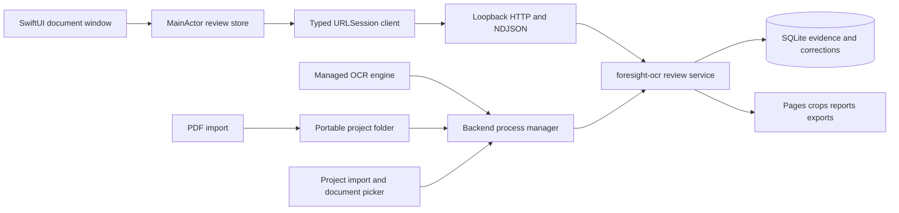

# Native macOS 27 client implementation contract

Status: the native reviewer, bundled standalone backend, project/import
contracts, managed OCR-engine runtime, and native no-CLI onboarding are
implemented in a development build. Developer ID signing and notarization
remain distribution work.

## Outcome

The native client is a macOS 27 document workstation for the complete foresight-ocr review workflow. It is not a WebView and it does not read or write the SQLite database directly. SwiftUI owns the Mac experience; the existing Python review service remains the only owner of OCR, correction, layout, export, and artifact semantics.

The target is a signed `.app` that lets a person who has never used the CLI
create a project from a PDF, install a compatible OCR engine on demand, manage
the loopback review-service child process, and use the native reviewer. Python,
`uv`, the `foresight-ocr` CLI, and project virtual environments are not end-user
prerequisites.

## Non-negotiable behavior

- Public product spelling is `foresight-ocr`; Swift module names may use `ForesightOCR`.
- Historical text is opaque Unicode data. Preserve Traditional Chinese, rare glyphs, empty printed identifiers, line breaks, and free-form additional information without normalization or schema coercion.
- `machine`, `human == nil`, `human == ""`, and `unreadable == true` are four different states. Never collapse them.
- Human corrections remain separate from OCR candidates and survive page or document re-recognition.
- Ignored pages stay navigable and restorable but are excluded from progress, OCR targets, and exports.
- Region overlays use the exact pixel geometry and aspect ratio returned for the image they cover.
- Green, blue, amber, and violet identify genealogy bands, not confidence. Selection, reviewed, disputed, header, and layout-boundary states also need non-color cues.
- Whole-document OCR is incremental by default (`force: false`) and uses the watermark-suppressed full-resolution variant.
- Correction learning is an explicit audit action. Merely opening its UI is read-only; analysis neither runs OCR nor enables rules.

## Runtime architecture



The Swift client must never reproduce Python parsing, numeral conversion, OCR selection, generation ordering, crop refresh, or export logic. It requests those results from the service.

### Source layout

```text
clients/macos/
  Package.swift
  Sources/
    ForesightOCRApp/
      ForesightOCRApp.swift
      Commands/
      Views/
    ForesightOCRCore/
      API/
      Models/
      Process/
      State/
  Tests/
    ForesightOCRCoreTests/
      Fixtures/
  Resources/
    Assets.xcassets/
    Localizable.xcstrings
  scripts/
    build-app.sh
```

Use Swift Package Manager with `// swift-tools-version: 6.4` and `platforms: [.macOS(.v27)]`. PackageDescription 6.2 knows the symbol but marks it unavailable, so lowering only the tools-version makes the manifest fail even under Xcode 27. The build script assembles the executable and resources into `Foresight OCR.app`, applies the required entitlements, and signs nested code before the outer app.

### Verified local toolchain

The 2026-08-26 development machine has the required native toolchain installed:

- `/Applications/Xcode-beta.app` is Xcode 27.0 (`27A5209h`).
- Its macOS SDK is 27.0.
- Its compiler is Apple Swift 6.4 targeting `arm64-apple-macosx27.0.0`.
- The global active developer directory still points at Command Line Tools, so bare `xcodebuild` fails. Development commands must use `DEVELOPER_DIR=/Applications/Xcode-beta.app/Contents/Developer` until the user deliberately changes `xcode-select`; the build scripts must not mutate that global setting.

The package now builds with this toolchain, and `scripts/build-app.sh` assembles
an ad-hoc-signed development `.app` whose Mach-O load command reports macOS 27.0
as both its minimum system and SDK. This is local build evidence, not Developer
ID or notarization evidence.

## Backend ownership and startup

The app supports two explicit connection modes:

1. **Managed service** — normal behavior. The app launches its bundled
   `foresight-ocr` executable with the selected project as
   `currentDirectoryURL`. A configured executable is a developer override, not
   an installation prerequisite.
2. **Attach to service** — development and recovery behavior. The user supplies a loopback URL and the app validates `/api/pages` before opening a window.

### Self-contained project and engine flow

The `.app` includes the standalone backend plus `uv`. Project creation and PDF
import are machine-readable backend commands invoked by the native process
manager. A project stores source PDFs, configs, derived artifacts, and SQLite
state, but no executable environment. The app keeps shared managed runtime data
under `~/Library/Application Support/Foresight OCR/`:

```text
engines/             one atomic, locked environment per OCR engine
python/              uv-managed Python 3.12 runtime
models/huggingface/  Hugging Face model cache
models/paddle/       Paddle model cache
cache/uv/            uv download and wheel cache
```

Engine installation is explicit and streams native progress. It installs
version-pinned direct requirements into a staging directory, probes the runner,
and atomically publishes only a ready environment. Interrupted staging and
swaps are recovered without overwriting unrelated environments. PP-OCRv5 is
available on supported Macs; PaddleOCR-VL's managed configuration is restricted
to Apple Silicon.

Project preparation also streams seven exact stages: preserve PDF, inspect PDF,
extract pages, normalize frames, detect layout, segment regions, and initial
OCR. Re-running it is incremental: unchanged OCR candidates are reused.

Managed startup relies on the following two implemented backend contracts.

### Machine-readable document manifest

The read-only command is:

```text
foresight-ocr documents --json
```

It emits one JSON object and no Rich formatting:

```json
{
  "protocol_version": 1,
  "project_root": "/selected/project",
  "documents": [
    {
      "id": "丙辰庶富教1",
      "title": "丙辰庶富教1",
      "page_count": 201,
      "reviewable": true,
      "entries": 3594,
      "reviewed": 222,
      "tag": "book-v3"
    }
  ]
}
```

The command uses `Project.discover()` and the existing review data functions. It must not make the Swift app query SQLite or infer documents from filenames.

### Ready handshake and ephemeral port

Launch managed review as:

```text
foresight-ocr review DOCUMENT --no-open --port 0 --ready-json
```

`serve()` must build its public URL from `server.server_port`, not the requested `port` argument. With `--ready-json`, stdout includes a flushed single-line record after the socket binds:

```json
{"type":"ready","protocol_version":1,"url":"http://127.0.0.1:49152","document_id":"丙辰庶富教1"}
```

The process manager scans stdout by `type`, preserves later diagnostic lines, validates a loopback `http` URL, and probes `/api/pages`. It never guesses a port.

The app terminates only a child process it owns. Closing a document window does not kill a running OCR job. Quitting while a managed job is `queued` or `running` presents a native warning because the current service keeps whole-document job state in memory.

### Primary crop image variants

The crop-first design exposes `原图 / 去水印` beside the primary crop. The current API cannot implement that selector reliably: `/api/page` returns whichever current tight crop was materialized last, without its variant, while `/api/page-image` changes only the full-page image.

Add a read-through crop endpoint before enabling that native control:

```text
GET /api/crop-image?region_uid=UID&variant=original|watermark
```

It resolves the stable region through the server, verifies that it belongs to the open document, calls the existing `ensure_crop(..., context="tight", variant=...)`, commits only the derived-cache row, and returns:

```json
{
  "region_uid": "...",
  "variant": "watermark",
  "path": "/opaque/service/path.png",
  "width": 812,
  "height": 2630,
  "pixel_bbox": [1240, 285, 2052, 2915]
}
```

Advertise this as `crop_image_variants` in `/api/pages`. A compatible older service still opens using each entry's existing `crop_path`, but the native crop-variant selector stays hidden or disabled instead of pretending that a page-image switch changed the crop.

## Transport contract

- Base URL is loopback HTTP only: `127.0.0.1`, `localhost`, or `::1` with the bound port.
- The server validates the `Host` header and accepts absent `Origin` and `Sec-Fetch-Site` headers, which is compatible with `URLSession`.
- JSON mutations require `Content-Type: application/json`, `Content-Length`, a top-level object, and at most 1,000,000 bytes.
- Ordinary API responses use `Cache-Control: no-store`. Image paths are immutable/content-addressed and may be cached.
- The client treats non-2xx status plus `{ "error": ... }` as a user-presentable service error. HTTP 409 means ignored-page or writer-busy conflict, not a networking failure.
- Page re-OCR and recut can return newline-delimited JSON. Decode arbitrary byte chunks into complete UTF-8 lines and accept exactly these event forms:
  - `{ "type": "progress", ... }`
  - `{ "type": "result", ... }`
  - `{ "type": "error", "error": "..." }`
- Whole-document OCR returns immediately and is polled separately. Do not hold one request open.
- Absolute artifact paths returned in JSON are opaque identifiers. Load them only through `/img?path=...`; never grant the Swift process direct arbitrary-file access based on an API string.

## API surface

| Operation | Request | Native responsibility |
| --- | --- | --- |
| Bootstrap | `GET /api/pages` | Decode document id, page summaries, progress, OCR tag, and capability strings. Unknown capabilities are preserved and ignored. |
| Page spread | `GET /api/page?page=P&spread=1...3` | Decode one to three sheets, exact width/height, ignored state, image path, frame status, and ordered entries. Keep selection by `region_uid`; use the selected entry's `crop_path` for the primary canvas and the sheet image only for context. |
| Image bytes | `GET /img?path=...` | Decode page and crop bytes with `CGImageSource`; cache by request URL; show a native missing-image state on errors. Treat `crop_path` as an opaque service token, including stitched cross-page crops. |
| Page image variant | `GET /api/page-image?page=P&variant=original|watermark` | Swap the source-context page image and geometry atomically so overlays never refer to the prior response. |
| Crop image variant | `GET /api/crop-image?region_uid=UID&variant=original|watermark` | Materialize and return the selected crop variant by stable identity. Update the primary canvas only if that identity is still selected. |
| Numeral | `GET /api/numeral?label=L&n=N` | Ask the backend to convert reviewer-entered Arabic digits; do not port numeral rules to Swift. |
| Grid preview | `GET /api/comb` | Send page, phase, pitch, left/right bounds, snap flag, and serialized manual boundary overrides; render returned boundaries without mutation. |
| Save correction | `POST /api/correction` | Send stable page/band/entry/role plus fields and unreadable state. Update saved UI only after success. Preserve explicit blank correction. |
| Unconfirm | `POST /api/correction` with `action: "unconfirm"` | Restore machine fallback; operation is idempotent. |
| Ignore/restore | `POST /api/page-ignore` | Replace page summaries and progress from the response; disable correction/OCR/recut while ignored. |
| Recut | `POST /api/recut` | Preview and apply identical grid parameters. Use NDJSON progress when `stream: true`. |
| Page OCR | `POST /api/reocr` | Use `variant: "watermark"` and NDJSON progress. Reload the affected page after the terminal result. |
| Document OCR | `POST /api/reocr-all` | Send `variant: "watermark", force: false`; accept 202 for a new job or 200 for the existing job. |
| OCR status | `GET /api/reocr-all` | Poll while queued/running; display stage, page position, region counts, percent, completion report, and errors. |
| Learning status | `GET /api/learn-ocr` | Read snapshot and freshness only. |
| Run learning | `POST /api/learn-ocr` | Present comparison and warn when the exact-core rate decreases. |
| Learning report | `GET /api/learn-ocr/report` | Present Markdown in a native auxiliary window or save it through an `NSSavePanel`. |
| Export | `GET /api/export.zip` | Use an `NSSavePanel`, stream bytes to a temporary file, then atomically move into place. |
| Expanded export | `POST /api/export` | Optional native per-file export; never reinterpret or reorder returned contents. |

## Swift model invariants

The typed core uses `Codable` and `Sendable` value types. JSON snake-case mapping is explicit or uses `.convertFromSnakeCase` only where it cannot obscure special keys.

Key models:

- `ReviewBootstrap`: `documentID`, `[Int] pages`, `[PageSummary] summary`, `ReviewProgress`, optional `tag`, `Set<String> capabilities`.
- `PageSummary`: `page`, `entries`, `flagged`, `reviewed`, `ignored`.
- `PageSpread`: requested page, sheets, progress.
- `ReviewSheet`: page, ignored, image token, pixel width/height, frame status, entries.
- `ReviewEntry`: every field returned by `ReviewEntry.to_dict()`, including `regionUID`, `role`, `state`, `bbox`, `cropBBox`, machine/human text, unreadable, note, findings, parsed fields, labels, expected id, flagged, stale-reading, and header kind.
- `ReviewJob`: nullable id/error/page/report and all idle/queued/running/complete/error counters.
- `ProgressEvent<Result>`: progress/result/error NDJSON envelope.

`ReviewEntry` identity is `regionUID` when present, otherwise the full `(pageIndex, bandLabel, entryIndex, role)` tuple. List indices are presentation details and never enter an API mutation.

Draft edits live separately from decoded server state. On save:

1. Capture the selected entry identity.
2. Send the draft fields.
3. Apply the response only if the same identity is still selected.
4. Refresh page summaries/progress.
5. Keep the draft and show a retryable error if the request fails.

## Native window and interaction mapping

The main window uses standard SwiftUI structure instead of custom-painted macOS chrome. Its hierarchy is deliberately crop-first: selected crop, transcription fields, source-page context, then navigation.

- A native `NSSplitViewController` hosts SwiftUI page navigation, source-page
  context, primary crop, and verification panes. This avoids a reproducible
  macOS 27 beta `List`/split constraint re-entry exception while retaining
  native resizable and independently collapsible panes.
- The page navigator has a compact 188 point preferred width and can resize from
  180–320 points. The context rail prefers 285 points but can resize from
  200–520 points, the inspector prefers 350 points and can resize from
  300–480 points, and the crop keeps a 320 point minimum with the lowest
  holding priority so it alone absorbs temporary space changes. Native
  split-view autosave preserves the user's widths across launches, while the
  representable caches and restores each pane's exact visible width across
  collapse and expansion.
- App menu commands keep sidebar, context, inspector, navigation, export, OCR,
  learning, and layout actions reachable when toolbar items overflow.
- A unified system toolbar with page back/forward, page location, context/two-page overview, crop fit/100%/zoom, original/watermark variant, overlay visibility, and inspector toggle. Infrequent mutation actions live in menus.
- Standard `List`, `Form`, `TextField`, `TextEditor`, `ProgressView`, `Menu`, `Toggle`, `Picker`, `Button`, alerts, sheets, and save/open panels.
- System semantic colors and materials. The crop surround is neutral graphite; the selected scanned crop is the brightest and largest uninterrupted visual object.
- Source-page overlays preserve genealogy-band outlines while adding explicit
  review state: reviewed entries use a green tint and checkmark, unreadable
  entries use amber tinting with a dashed line and question mark, and disputes
  use a red outline and exclamation mark. A compact legend makes color a
  redundant rather than exclusive signal.
- Standard controls receive the macOS 27 appearance automatically. Custom `glassEffect` is reserved for a proven interaction need; it is not a background treatment.
- Observe `appearsActive`, `accessibilityShowBorders`, Reduce Transparency, Increase Contrast, accent color, and Full Keyboard Access.

### Primary crop canvas

Use a native AppKit-backed canvas where SwiftUI alone does not provide precise zoom and coordinate conversion:

- `NSScrollView` provides magnification, panning, trackpad gestures, and
  fit-to-height. A newly selected crop fits the available height by default;
  manual zoom remains in effect until the reviewer chooses fit-to-height again.
- The primary document view displays the selected entry's `crop_path` at native aspect ratio. It never stretches a narrow genealogy column merely to fill the pane.
- Fit, 100%, zoom, and pan operate on the crop. When `crop_image_variants` is advertised, original/watermark switching replaces crop pixels and metadata atomically before the selection decoration redraws.
- The selected crop remains pinned while a field is edited. A page refresh may replace its pixels only when the same stable entry identity still exists; otherwise the store requires an explicit new selection.
- Cross-page stitched crops are displayed exactly as served. Swift does not reorder or reconstruct fragments.
- Missing or stale crop bytes produce a recoverable native placeholder and keep the transcription draft intact.

### Source-page context rail

- One page image and its transparent region overlay share the same coordinate space in a smaller `NSScrollView`.
- Convert server pixel rectangles with one aspect-fit transform derived from the exact response width and height.
- Selecting a region in the context rail updates the primary crop and inspector by stable entry identity. The selected source rectangle is visible with a non-color cue.
- The rail can switch to a two-page overview when cross-page continuity matters. It composes independent page views with preserved aspect ratios and never stretches pages to equal widths or heights.
- Context collapse must not discard selection, draft edits, zoom state for the crop, or the ability to restore the rail from the View menu.

### Editing and keyboard behavior

- Use standard Command shortcuts in menu commands and never steal system or input-source shortcuts.
- Keep all review navigation discoverable in menus. Provide a configurable compatibility set for the existing Control-based review commands.
- Ignore navigation commands while an editor has marked text (`hasMarkedText`) or the app is processing an IME composition.
- The Return-key confirmation command never fires from a multiline additional-information editor without an explicit Command modifier.
- Focus advances only after the correction POST succeeds.
- Autosave is not implied. If enabled later, the UI must distinguish edited, saving, saved, and failed states and must debounce by stable entry identity.

## Security and distribution

- Listen on loopback only; reject remote URLs in attach mode.
- Do not expose database paths, arbitrary file reads, or backend stderr in normal UI. A diagnostics sheet may show redacted logs.
- The first Developer ID distribution uses hardened runtime and notarization. App Sandbox is not assumed because the app launches a bundled Python service and OCR subprocesses against user-selected project trees.
- Sign nested Python/Mach-O code first, then the outer app. Preserve third-party notices from the existing standalone build.
- The base standalone backend is large, and optional ML runner environments are
  installed separately into Application Support. A real packaged PP-OCRv5
  install, runner probe, initial OCR pass, and incremental reuse pass have been
  exercised; release completion still requires checking each engine intended
  for that release and its redistribution terms.

## Verification matrix

### Swift unit tests

- Decode checked-in fixtures for every endpoint, including null fields, explicit blank corrections, ignored pages, headers, stale readings, and unknown capabilities.
- Split NDJSON across every byte boundary that can separate a multibyte CJK scalar or newline.
- Verify error/status mapping, cancellation, retry, and stale-selection protection.
- Verify aspect-fit transforms and inverse hit-testing for one-, two-, and three-page spreads.
- Verify backend ready-line parsing, port validation, child ownership, early exit, and log truncation.

### Python contract tests

- `--port 0 --ready-json` reports the actual bound port and flushes before serving.
- `documents --json` is stable, Unicode-safe, read-only, and contains only reviewable facts derived through project APIs.
- Existing browser routes and security checks remain unchanged.
- Add representative JSON snapshots only for protocol stability; do not freeze incidental ordering or absolute paths.

### Live integration

- Launch the real populated project through the app and verify `/api/pages`, a two-page spread, page and crop image bytes, correction learning, and export.
- Exercise correction, unconfirm, unreadable, ignore/restore, page re-OCR, recut, and whole-document OCR against a disposable project fixture so the reviewed corpus is not altered.
- Prove that quitting/closing cannot silently terminate a running managed OCR job.
- Build `Foresight OCR.app`, inspect linked deployment targets, verify its signature, launch it from Finder, and repeat the managed-service smoke test from the bundle.

Current self-contained-path evidence from 2026-08-26:

- The ad-hoc-signed arm64 development app contains a 327 MB standalone backend
  and the 41 MB `uv` executable; the complete app is 372 MB.
- With system/user Python and `uv` removed from `PATH`, the bundled backend used
  bundled `uv` to install a managed Python 3.12 runtime and pinned PP-OCRv5
  environment under a temporary Application Support root.
- A one-page PDF was imported into a project with no `.venv`, prepared through
  all seven stages, and produced 36 regions and 36 OCR candidates.
- A second preparation reused all 36 OCR candidates with no engine reinstall.
- The packaged app was also exercised through the native welcome, PDF import,
  destination picker, project creation, manifest-driven engine picker, and
  both in-progress and completed seven-stage preparation views. A real bundled
  backend created `/private/tmp/foresight-ui-smoke` from the PDF without a
  project `.venv`; a disposable streamed backend was used only to inspect the
  preparation UI without duplicating a large engine install in the user's real
  Application Support directory.
- This proves the self-contained development path and native UI state flow. It
  does not substitute for Developer ID signing and notarization.

### Visual and accessibility acceptance

- Inspect the real app at minimum width, 1512×982, a large external-display width, light appearance, dark appearance, inactive window state, Reduce Transparency, Increase Contrast, and Show Borders.
- At 1512×982, verify the selected crop is the single largest uninterrupted surface: approximately 210–220 points for navigation, 260–300 for page context, 340–360 for the inspector, and the remaining flexible width for the crop canvas.
- Verify navigation, page context, and inspector collapse independently; their collapse and restoration preserve selection and drafts, and the crop canvas always retains a useful review area.
- Verify VoiceOver labels and order, Full Keyboard Access, focus rings, menus, localized shortcut discoverability, and Chinese IME composition.
- Capture real app screenshots only after the live service and actual corpus imagery are visible.

## Completion gate

The native-client objective is complete only when all of the following are direct evidence, not assumptions:

- A native SwiftUI/AppKit `.app` exists and contains no WebView implementation of the reviewer.
- Managed project/document startup and loopback process ownership work from the packaged app.
- All review capabilities advertised by `/api/pages` have a reachable native workflow or an explicit compatibility error for an older backend.
- The correction, historical-text, geometry, ignore-page, OCR, learning, and export invariants above pass automated and live tests.
- The app is visually inspected on macOS 27 in the required accessibility and window configurations.
- The packaged sidecar can execute the real OCR path, or the release clearly and reliably attaches to a separately installed compatible compute backend without claiming to be self-contained.
- Signing/notarization requirements appropriate to the chosen distribution channel are verified.

## Implementation order after approval

1. Add and test the document-manifest and ready-handshake backend contracts.
2. Create the macOS 27 Swift package, typed models, HTTP/NDJSON client, and process manager.
3. Implement project/document opening, page sidebar, canvas, inspector, correction, and export as the first complete vertical slice.
4. Add page variants, ignore/restore, re-OCR, document OCR, learning, and layout-repair mode.
5. Build the `.app`, run unit/full-suite/live integration tests, and perform visual/accessibility inspection.
6. Finish sidecar packaging, nested signing, notarization, documentation, and final requirement-by-requirement audit.
